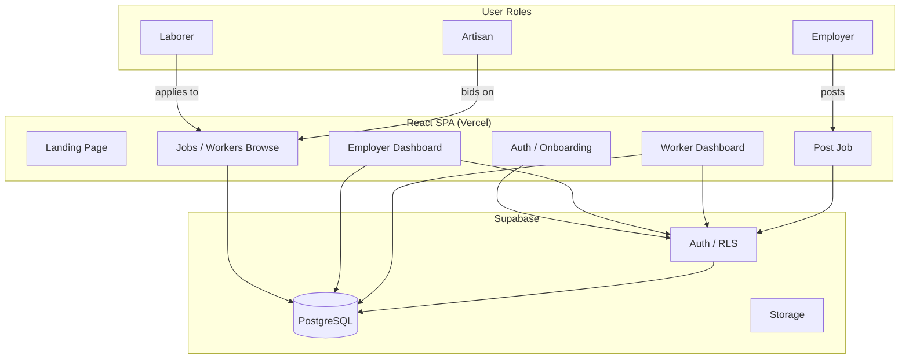

# LaborLink — Trust Jobs Marketplace


A full-stack job marketplace connecting daily-wage laborers, skilled artisans, and employers. Built with trust scoring, role-based dashboards, and a custom-craft bidding system.

## Stack

- TypeScript / React 18 — front-end
- Vite 5 + Tailwind CSS + shadcn/ui — build and design system
- Supabase — backend (PostgreSQL, Auth, Storage, Row-Level Security)
- TanStack React Query — server state management
- react-hook-form + Zod — form validation
- Lucide React — icons

## How it works

LaborLink serves three user roles:

**Laborers** browse and search jobs by category and location, view detailed job information with employer ratings, and apply with a custom message and expected wage.

**Employers** post jobs with wage type (hourly / daily / fixed), review applicants with trust scores and experience, and accept or reject applications.

**Artisans** browse custom-craft projects and submit bids with amount, timeline, and a message. Employers can upload reference images for craft projects.

Every user has a trust score (0–5) built from reviews and ratings. Verified profiles, trust badges, and transparent review histories build accountability into the marketplace.

## Key features

- Three-role system (laborer, employer, artisan) with separate dashboards
- Trust scoring — 1–5 star reviews drive profile trustworthiness
- Custom-craft marketplace — artisans bid on bespoke projects
- In-app messaging between hiring parties
- Payment tracking with status pipeline
- Row-Level Security on every database table
- Dark mode and responsive design

## Architecture



## What this demonstrates

- Full-stack web application with authentication and authorization
- Role-based access control with Supabase RLS
- Real-time database queries and server state management
- Responsive design with Tailwind CSS
- Form validation and user onboarding flows
- Marketplace platform architecture

## Run locally

```bash
npm install
cp .env.example .env   # add Supabase credentials
npm run dev
```
